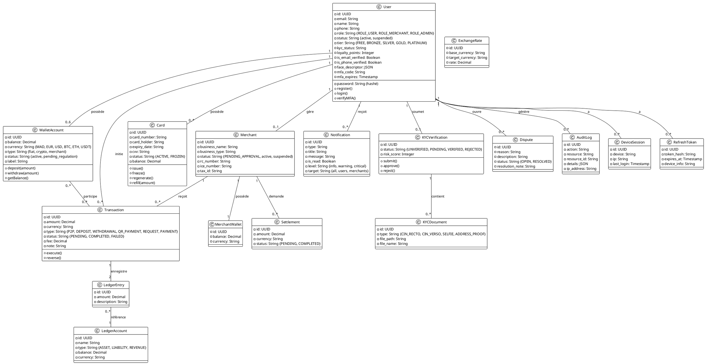
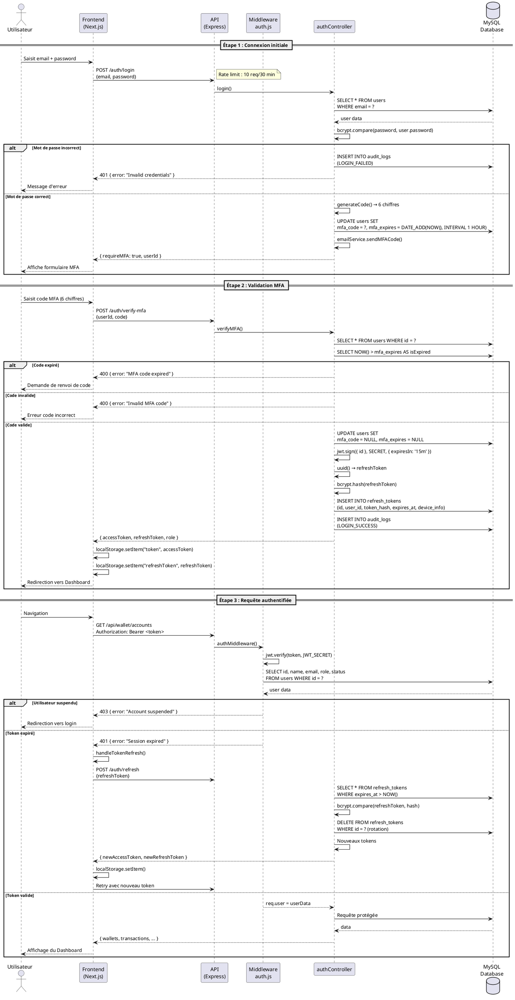
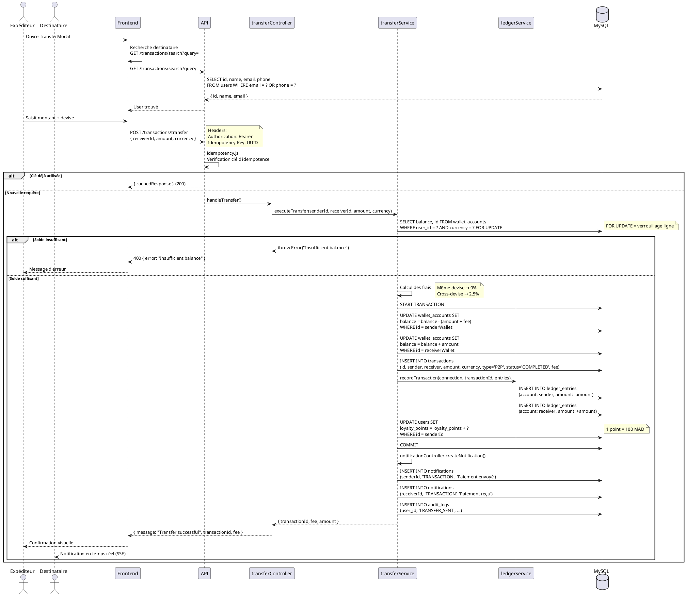
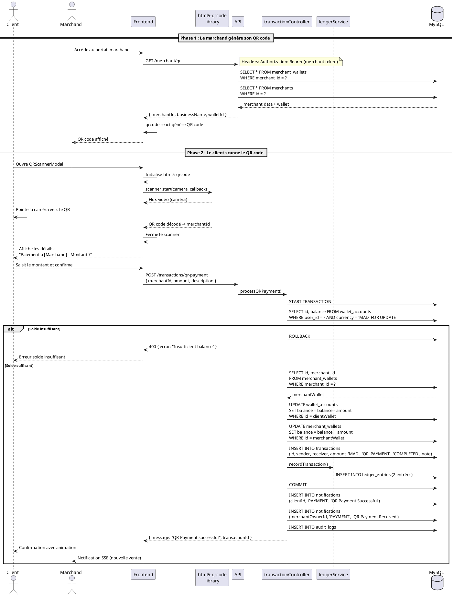
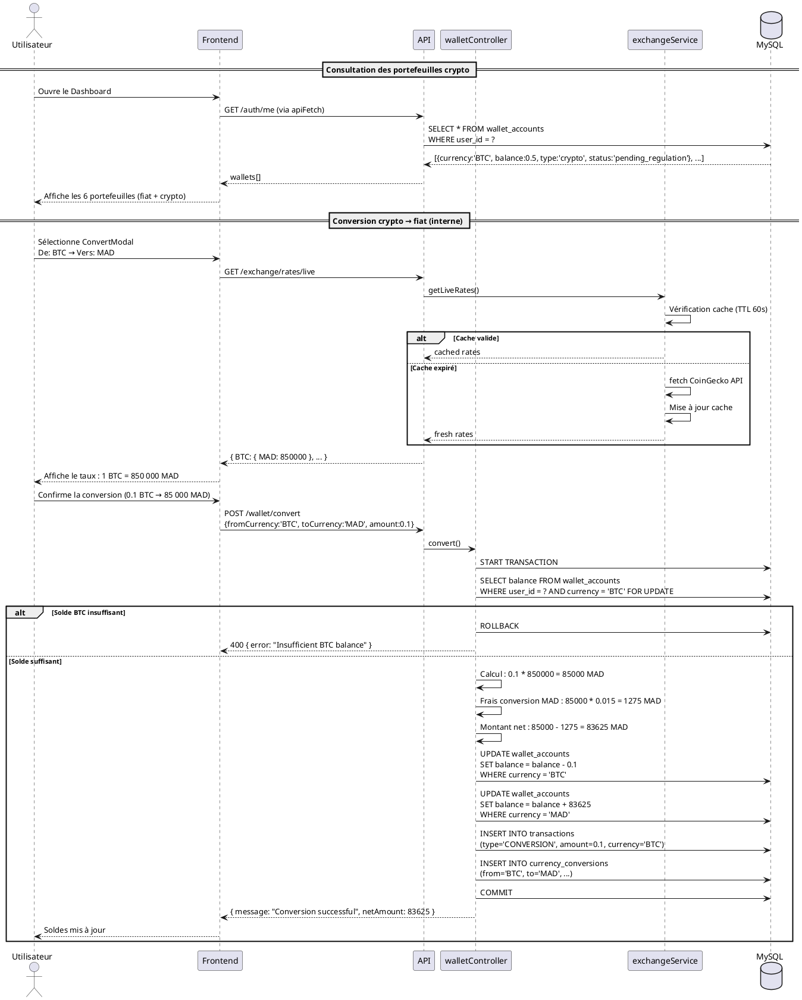
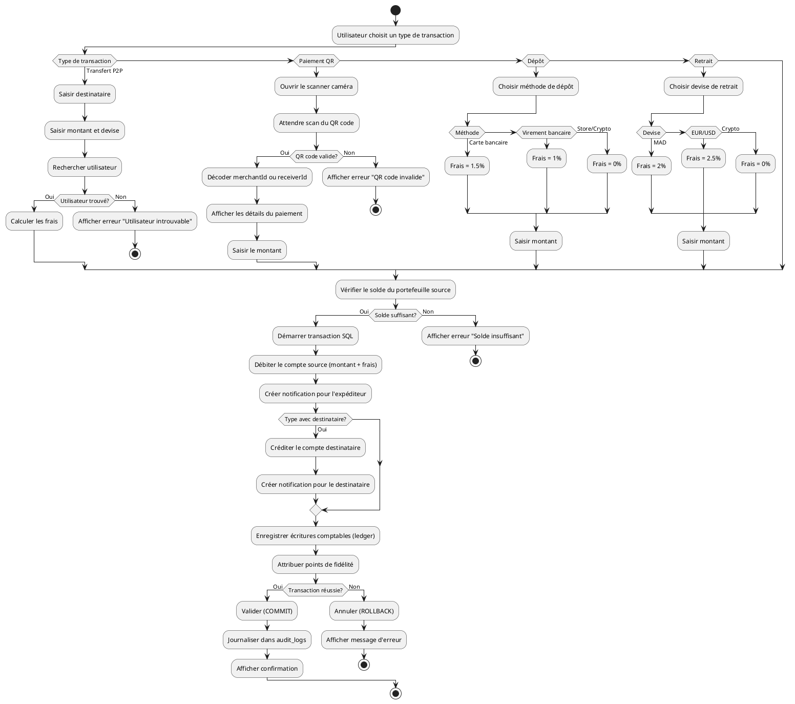
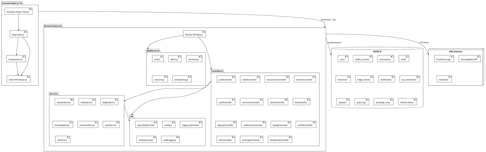
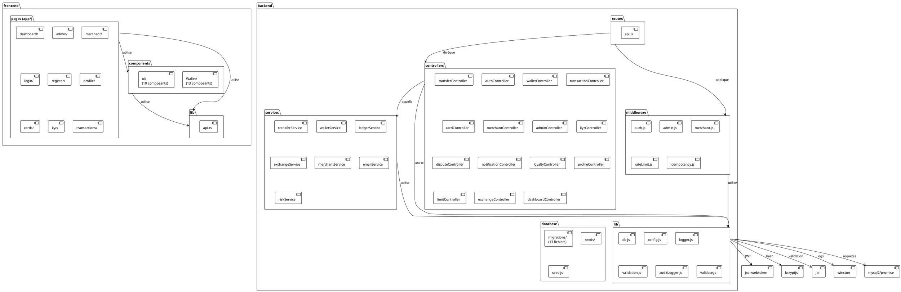
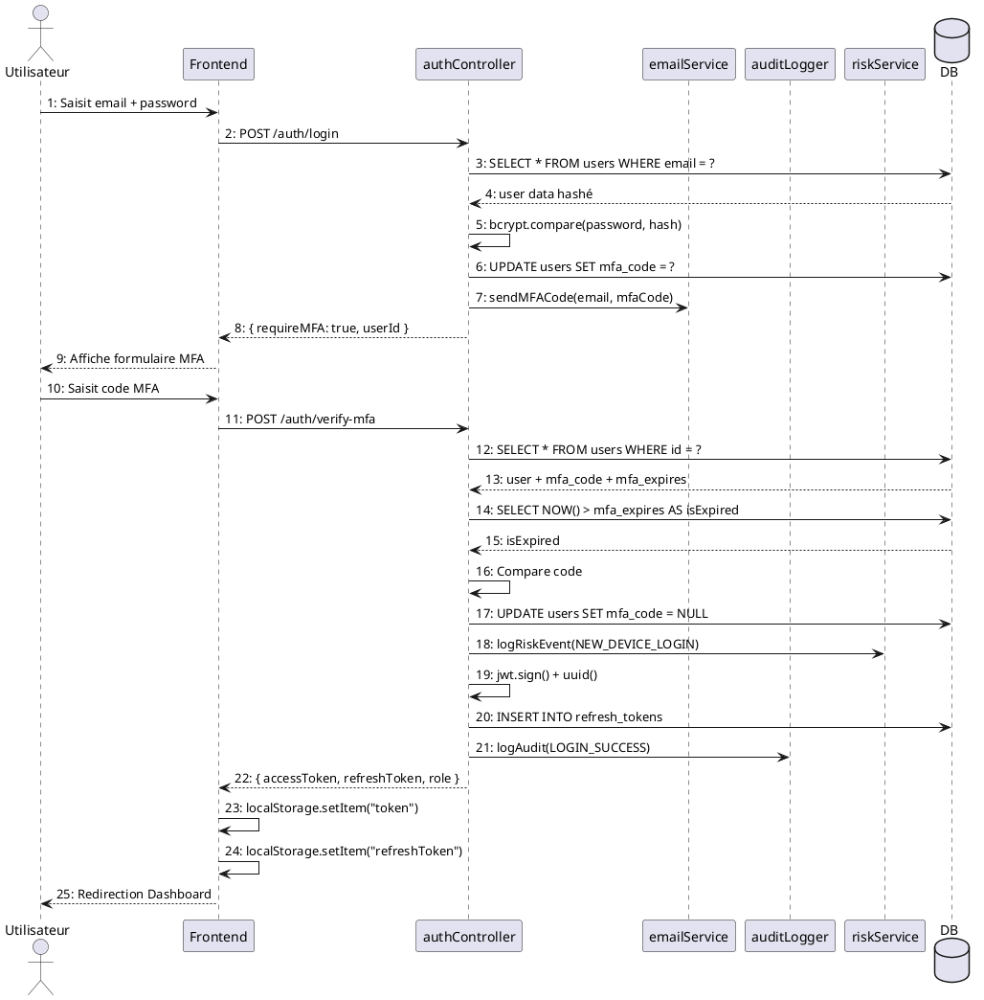
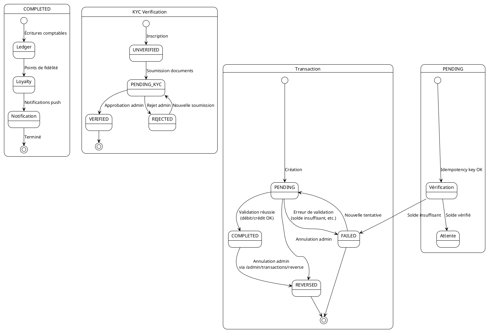

# Diagrammes UML — Marjane Wallet

**Projet de Fin d'Études (PFE) — EFET**

---

## Table des matières

1. [Diagramme de cas d'utilisation](#1-diagramme-de-cas-dutilisation)
2. [Diagramme de classes](#2-diagramme-de-classes)
3. [Diagramme de séquence — Authentification](#3-diagramme-de-séquence--authentification)
4. [Diagramme de séquence — Paiement P2P](#4-diagramme-de-séquence--paiement-p2p)
5. [Diagramme de séquence — Paiement QR](#5-diagramme-de-séquence--paiement-qr)
6. [Diagramme de séquence — Paiement Crypto](#6-diagramme-de-séquence--paiement-crypto)
7. [Diagramme d'activités](#7-diagramme-dactivités)
8. [Diagramme de composants](#8-diagramme-de-composants)
9. [Diagramme de déploiement](#9-diagramme-de-déploiement)
10. [Diagramme de packages](#10-diagramme-de-packages)
11. [Diagramme de communication](#11-diagramme-de-communication)
12. [Diagramme d'états](#12-diagramme-détats)

---

## 1. Diagramme de cas d'utilisation

### Description

Ce diagramme représente les interactions entre les acteurs du système (Utilisateur, Marchand, Administrateur) et les fonctionnalités offertes par l'application Marjane Wallet. Chaque acteur possède un ensemble de cas d'utilisation correspondant à ses droits d'accès.

**Acteurs identifiés :**
- **Utilisateur** : Personne inscrite sur la plateforme pouvant gérer ses portefeuilles
- **Marchand** : Commerçant disposant d'un portefeuille marchand pour accepter les paiements
- **Administrateur** : Gestionnaire du système avec accès à toutes les fonctionnalités d'administration

### Code PlantUML

```plantuml
@startuml
left to right direction

actor "Utilisateur" as User
actor "Marchand" as Merchant
actor "Administrateur" as Admin

rectangle "Marjane Wallet" {
  !define UserUsecases [
  usecase "UC01 - S'inscrire" as UC1
  usecase "UC02 - Se connecter" as UC2
  usecase "UC03 - Gérer ses portefeuilles\n(MAD, EUR, USD, BTC, ETH, USDT)" as UC3
  usecase "UC04 - Effectuer un transfert\nP2P" as UC4
  usecase "UC05 - Déposer des fonds" as UC5
  usecase "UC06 - Retirer des fonds" as UC6
  usecase "UC07 - Convertir des devises" as UC7
  usecase "UC08 - Payer par QR code" as UC8
  usecase "UC09 - Demander de l'argent" as UC9
  usecase "UC10 - Gérer ses cartes\nvirtuelles" as UC10
  usecase "UC11 - Vérifier son identité\n(KYC)" as UC11
  usecase "UC12 - Consulter l'historique\ndes transactions" as UC12
  usecase "UC13 - Voir les notifications" as UC13
  usecase "UC14 - Gérer son profil" as UC14
  usecase "UC15 - Participer au programme\nde fidélité" as UC15
  ]

  usecase "UC16 - Gérer son portail\nmarchand" as UC16
  usecase "UC17 - Demander l'onboarding" as UC17
  usecase "UC18 - Générer des QR codes" as UC18
  usecase "UC19 - Demander un règlement\n(settlement)" as UC19
  usecase "UC20 - Voir les statistiques\nde ventes" as UC20

  usecase "UC21 - Se connecter en tant\nqu'admin" as UC21
  usecase "UC22 - Gérer les utilisateurs" as UC22
  usecase "UC23 - Superviser les\ntransactions" as UC23
  usecase "UC24 - Gérer les demandes\nmarchandes" as UC24
  usecase "UC25 - Gérer les\nvérifications KYC" as UC25
  usecase "UC26 - Gérer les litiges" as UC26
  usecase "UC27 - Diffuser des\nnotifications" as UC27
  usecase "UC28 - Consulter le journal\nd'audit" as UC28
  usecase "UC29 - Gérer la comptabilité\n(ledger)" as UC29
}

User --> UC1
User --> UC2
User --> UC3
User --> UC4
User --> UC5
User --> UC6
User --> UC7
User --> UC8
User --> UC9
User --> UC10
User --> UC11
User --> UC12
User --> UC13
User --> UC14
User --> UC15

Merchant --> UC16
Merchant --> UC17
Merchant --> UC18
Merchant --> UC19
Merchant --> UC20
Merchant --> UC2
Merchant --> UC12
Merchant --> UC13

Admin --> UC21
Admin --> UC22
Admin --> UC23
Admin --> UC24
Admin --> UC25
Admin --> UC26
Admin --> UC27
Admin --> UC28
Admin --> UC29

UC16 ..> UC17 : <<include>>
UC16 ..> UC20 : <<include>>

@enduml
```

### Description détaillée

| Code | Cas d'utilisation | Acteur | Description |
|------|-------------------|--------|-------------|
| UC01 | S'inscrire | Utilisateur | Création de compte avec email, mot de passe, nom, téléphone. Création automatique de 6 portefeuilles. |
| UC02 | Se connecter | Utilisateur, Marchand | Authentification avec email/mot de passe + validation MFA |
| UC03 | Gérer portefeuilles | Utilisateur | Consultation des soldes des 6 comptes, activation/désactivation |
| UC04 | Transfert P2P | Utilisateur | Envoi d'argent à un autre utilisateur avec frais variables |
| UC08 | Payer par QR | Utilisateur | Scan d'un QR code marchand ou utilisateur pour payer |
| UC16 | Portail marchand | Marchand | Accès au dashboard, statistiques, QR codes, règlements |
| UC22 | Gérer utilisateurs | Admin | Liste, suspension, activation, réinitialisation MFA |
| UC23 | Superviser transactions | Admin | Consultation, filtrage, annulation de transactions |
| UC24 | Gérer demandes marchandes | Admin | Approbation/rejet des demandes d'onboarding |
| UC29 | Gérer comptabilité | Admin | Consultation du ledger, réconciliation des comptes |

---

## 2. Diagramme de classes

### Description

Ce diagramme présente les principales entités du domaine et leurs relations. Il est basé sur le schéma de base de données MySQL et les modèles métier utilisés dans l'application.

### Code PlantUML



### Description détaillée

| Classe | Rôle | Attributs clés | Associations |
|--------|------|----------------|--------------|
| **User** | Entité centrale représentant un utilisateur | id, email, password (hashé), role, status, tier | Possède 6 WalletAccount, initie des Transaction |
| **WalletAccount** | Portefeuille d'une devise spécifique | id, balance, currency, type, status | Lié à un User via user_id |
| **Transaction** | Opération financière entre deux wallets | id, amount, type, status, fee | Lien vers sender_wallet et receiver_wallet |
| **Card** | Carte virtuelle MAD | card_number, expiry_date, cvv, status | Lié à un User et optionnellement un WalletAccount |
| **Merchant** | Compte marchand | business_name, business_type, status, rc, ice | Géré par un User, possède un MerchantWallet |
| **LedgerEntry** | Écriture comptable double entrée | amount, description | Associé à une Transaction et un LedgerAccount |
| **Notification** | Message utilisateur ou système | type, title, message, is_read, level, target | Envoyée à un User |
| **KYCVerification** | Processus de vérification d'identité | status, risk_score | Soumis par un User, contient des KYCDocument |
| **Dispute** | Litige sur une transaction | reason, description, status | Ouvert par un User, lié à une Transaction |

---

## 3. Diagramme de séquence — Authentification

### Description

Ce diagramme illustre le flux complet d'authentification d'un utilisateur, depuis la soumission du formulaire de connexion jusqu'à l'obtention des jetons JWT après validation du code MFA.

### Code PlantUML



### Flux détaillé

| Étape | Action | Données échangées |
|-------|--------|-------------------|
| 1. Login | Client → API | `{ email, password }` |
| 1.1 | Vérification bcrypt | Comparaison du hash |
| 1.2 | Génération MFA | Code 6 chiffres, stocké avec expiration |
| 1.3 | Réponse | `{ requireMFA: true, userId }` |
| 2. Vérification MFA | Client → API | `{ userId, code }` |
| 2.1 | Vérification expiration | `SELECT NOW() > mfa_expires` |
| 2.2 | Vérification code | Comparaison exacte (case-insensitive) |
| 2.3 | Génération tokens | JWT 15min + refresh 30 jours |
| 2.4 | Réponse | `{ accessToken, refreshToken, role }` |
| 3. Requête protégée | Header | `Authorization: Bearer <JWT>` |
| 3.1 | Vérification JWT | jwt.verify + SELECT user |
| 3.2 | Refresh si 401 | Rotation avec bcrypt.compare sur tous les tokens |

---

## 4. Diagramme de séquence — Paiement P2P

### Description

Ce diagramme détaille le flux complet d'un transfert d'argent entre deux utilisateurs, incluant la validation, le calcul des frais, la double comptabilité et les notifications.

### Code PlantUML



### Calcul des frais détaillé

| Condition | Frais | Exemple (1000 MAD) |
|-----------|-------|--------------------|
| Même devise (MAD→MAD) | 0% | 0 MAD |
| Cross-devise (MAD→EUR) | 2,5% | 25 MAD |
| Dépôt bancaire | 1% | 10 MAD |
| Dépôt carte | 1,5% | 15 MAD |
| Retrait MAD | 2% | 20 MAD |

---

## 5. Diagramme de séquence — Paiement QR

### Description

Ce diagramme illustre le flux de paiement par QR code, depuis l'ouverture du scanner jusqu'à la confirmation du paiement, en passant par le décodage du QR et l'exécution de la transaction.

### Code PlantUML



### Types de QR supportés

| Type | Données encodées | Destination | Wallet |
|------|-------------------|-------------|--------|
| Marchand | `merchantId` (UUID) | Compte marchand | `merchant_wallets` |
| Utilisateur | `receiverId` (UUID) | Utilisateur direct | `wallet_accounts` |

---

## 6. Diagramme de séquence — Paiement Crypto

### Description

Ce diagramme présente la gestion des crypto-monnaies (BTC, ETH, USDT) dans la plateforme. Bien que les wallets crypto existent, les transferts sont internes à la plateforme (hors chaîne) en attendant la régulation.

### Code PlantUML



### Statut des wallets crypto

| Devise | Type | Statut | Fonctionnalités |
|--------|------|--------|-----------------|
| BTC | crypto | `pending_regulation` | Consultation, conversion interne |
| ETH | crypto | `pending_regulation` | Consultation, conversion interne |
| USDT | crypto | `pending_regulation` | Consultation, conversion interne |

---

## 7. Diagramme d'activités

### Description

Ce diagramme modélise le flux complet d'une transaction depuis l'initiation jusqu'à la finalisation, en incluant les différents chemins possibles (succès, échec, annulation).

### Code PlantUML



### Description des branches

| Branche | Condition | Actions |
|---------|-----------|---------|
| Transfert P2P | Destinataire trouvé | Calcul frais (0% ou 2,5%), validation solde, exécution |
| Paiement QR | QR valide | Scan → décodage → confirmation montant → exécution |
| Dépôt | Méthode choisie | Frais variables (0-1,5%), mise à jour solde |
| Retrait | Devise choisie | Frais variables (0-2,5%), mise à jour solde |
| Échec | Solde insuffisant | Rollback transactionnel, message d'erreur |

---

## 8. Diagramme de composants

### Description

Ce diagramme présente l'architecture physique des composants logiciels et leurs dépendances. Il montre comment les différents modules interagissent entre eux et avec les systèmes externes.

### Code PlantUML



### Dépendances entre composants

| Composant | Dépend de | Type de dépendance |
|-----------|-----------|-------------------|
| Pages Next.js | Composants UI, Client API | Import direct |
| Client API | Backend (API Express) | HTTP REST |
| Routeur API | Middlewares, Contrôleurs | Import require |
| Contrôleurs | Services, Lib (db, auditLogger) | Import require |
| Services | Lib (db) | Import require |
| Services | APIs externes | HTTP fetch |
| Backend | MySQL 8 | mysql2/promise |

---

## 9. Diagramme de déploiement

### Description

Ce diagramme décrit l'architecture physique de déploiement de l'application, que ce soit en environnement de développement ou en production avec Docker.

### Code PlantUML

```plantuml
@startuml
!theme plain

actor "Utilisateur" as User
actor "Administrateur" as Admin
actor "Marchand" as Merchant

node "Navigateur Web" as Browser {
  [Application React (Next.js)]
}

node "Serveur de Développement" as DevServer {
  [Node.js Dev Server\n(Next.js)\nPort 3000] as NextDev
  [Node.js API Server\n(Express)\nPort 5000] as ExpressDev
}

node "Environnement Docker" as Docker {
  [Conteneur Frontend\nNode.js 18\nPort 3000\nnpm run start] as FrontendCont
    
  [Conteneur Backend\nNode.js 18\nPort 5000\nnode src/app.js] as BackendCont
    
  [Conteneur MySQL\nMySQL 8.0\nPort 3306] as MySQLCont
}

node "APIs Externes" as External {
  [Frankfurter.app\n(Taux de change)]
  [ExchangeRate-API\n(Taux de change)]
  [CoinGecko\n(Prix crypto)]
}

User --> Browser : HTTPS
Admin --> Browser : HTTPS
Merchant --> Browser : HTTPS

Browser --> DevServer : http://localhost:3000
Browser --> Docker : https://marjane-wallet.com

DevServer --> ExpressDev : API Proxy /api/*
ExpressDev --> MySQLCont : mysql://root@localhost:3306/marjane_wallet

Docker {
  FrontendCont --> BackendCont : API /api/*
  BackendCont --> MySQLCont : mysql://root@mysql:3306/marjane_wallet
}

BackendCont --> External : HTTP (fetch)
ExpressDev --> External : HTTP (fetch)

note right of Docker
  docker-compose.yml
  - mysql (healthcheck)
  - backend (dépend de mysql)
  - frontend (dépend de backend)
end note

note right of ExpressDev
  Fichiers .env :
  - .env.development
  - .env.production
  - .env.staging
end note

@enduml
```

### Configuration Docker

```yaml
services:
  mysql:
    image: mysql:8.0
    ports: ["3306:3306"]
    volumes: [mysql_data:/var/lib/mysql]

  backend:
    build: ./backend
    ports: ["5000:5000"]
    environment:
      DATABASE_URL: mysql://root@mysql:3306/marjane_wallet
    depends_on: [mysql: condition: service_healthy]

  frontend:
    build: ./frontend
    ports: ["3000:3000"]
    environment:
      NEXT_PUBLIC_API_URL: http://localhost:5000/api
    depends_on: [backend]
```

### Fichiers d'environnement

| Fichier | Utilisation | NODE_ENV |
|---------|-------------|----------|
| `.env.development` | Développement local | development |
| `.env.staging` | Pré-production | staging |
| `.env.production` | Production | production |

---

## 10. Diagramme de packages

### Description

Ce diagramme présente l'organisation en packages du code source, en suivant la structure réelle des dossiers du projet. Il montre les dépendances entre les packages et le sens des imports.

### Code PlantUML



### Description des packages

| Package | Contenu | Dépendances |
|---------|---------|-------------|
| `frontend/src/app` | Pages Next.js (App Router) | Components, lib/api.ts |
| `frontend/src/components` | Composants React | lib/api.ts |
| `frontend/src/lib` | Client API | Backend (HTTP) |
| `backend/src/routes` | Définition des routes | Controllers, Middleware |
| `backend/src/controllers` | Logique métier | Services, Lib |
| `backend/src/services` | Services métier | Lib (db) |
| `backend/src/middleware` | Filtres HTTP | Lib (db, jwt) |
| `backend/src/lib` | Utilitaires | Packages npm |
| `backend/database` | Migrations + Seed | Knex |

---

## 11. Diagramme de communication

### Description

Ce diagramme montre les interactions entre les objets lors du flux d'authentification, en mettant l'accent sur la séquence temporelle des échanges.

### Code PlantUML



### Séquence des échanges

| # | Émetteur | Destinataire | Message |
|---|----------|-------------|---------|
| 1 | Utilisateur | Frontend | Email + mot de passe |
| 2 | Frontend | authController | POST /auth/login |
| 3 | authController | DB | SELECT utilisateur |
| 4 | DB | authController | Données utilisateur |
| 5 | authController | authController | Vérification bcrypt |
| 6 | authController | DB | UPDATE code MFA |
| 7 | authController | emailService | Envoi email MFA |
| 8 | authController | Frontend | requireMFA: true |
| 9 | Frontend | Utilisateur | Formulaire MFA |
| 10 | Utilisateur | Frontend | Code MFA |
| 11 | Frontend | authController | POST /auth/verify-mfa |
| 12-15 | authController | DB | Vérification code MFA |
| 16-17 | authController | DB | Validation + effacement |
| 18 | authController | riskService | Log nouvel appareil |
| 19-21 | authController | DB | Génération tokens + audit |
| 22-25 | authController | Utilisateur | Tokens + redirection |

---

## 12. Diagramme d'états

### Description

Ce diagramme modélise les différents états d'une transaction et les transitions possibles entre ces états, depuis sa création jusqu'à son achèvement ou son annulation.

### Code PlantUML



### États d'une transaction

| État | Description | Transitions possibles |
|------|-------------|----------------------|
| **PENDING** | En attente de validation | → COMPLETED, → FAILED, → REVERSED |
| **COMPLETED** | Transaction réussie | → REVERSED |
| **FAILED** | Échec (solde, erreur technique) | → PENDING (pas dans l'app actuelle) |
| **REVERSED** | Annulée par l'administrateur | Terminus |

### États KYC

| État | Description | Transitions possibles |
|------|-------------|----------------------|
| **UNVERIFIED** | Aucun document soumis | → PENDING_KYC |
| **PENDING_KYC** | Documents soumis, en attente de revue | → VERIFIED, → REJECTED |
| **VERIFIED** | KYC approuvé | Terminus |
| **REJECTED** | KYC rejeté | → PENDING_KYC |

### États d'un litige

| État | Description | Transitions possibles |
|------|-------------|----------------------|
| **OPEN** | Litige ouvert, en cours d'investigation | → RESOLVED |
| **RESOLVED** | Résolu par l'administrateur | Terminus |

---

*Document généré le 26 juin 2026 — Projet Marjane Wallet PFE*
